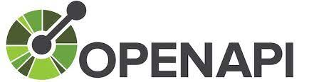
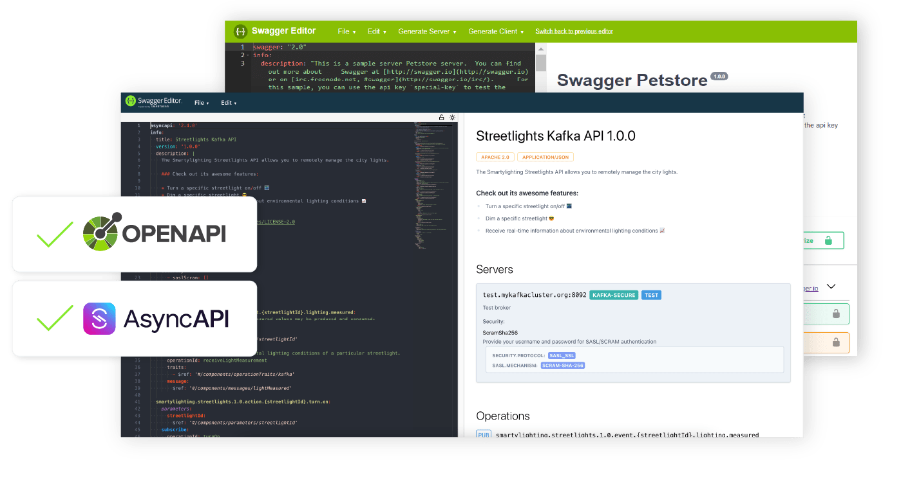
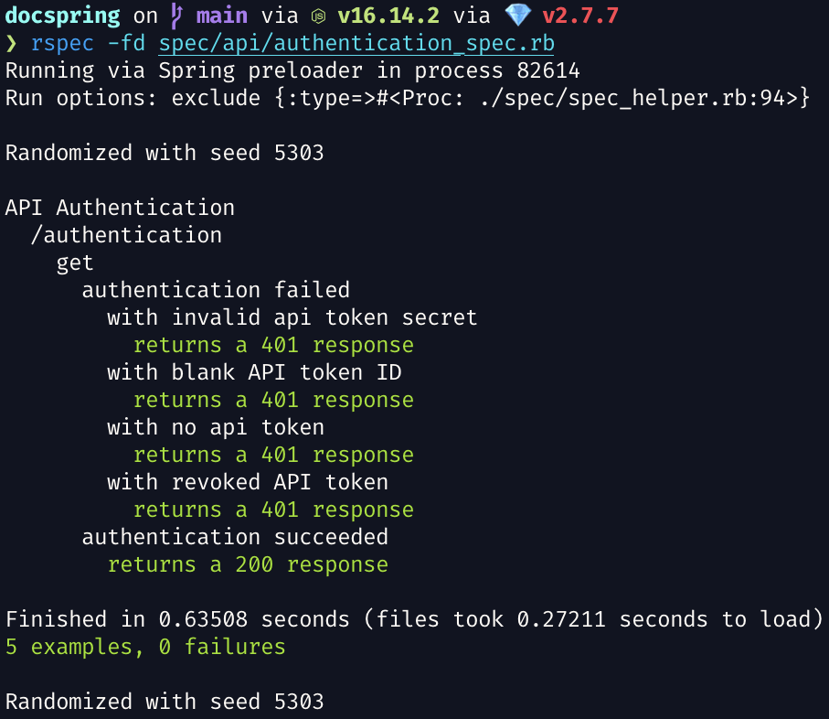
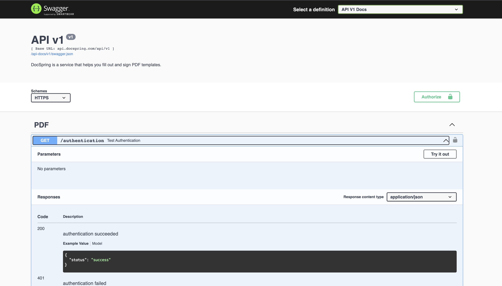
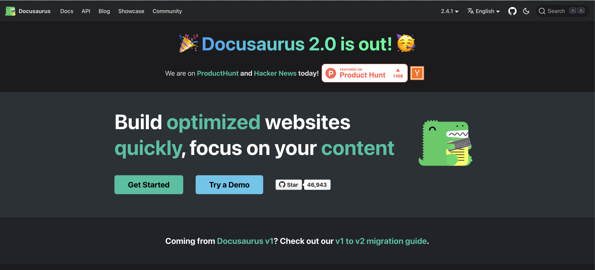
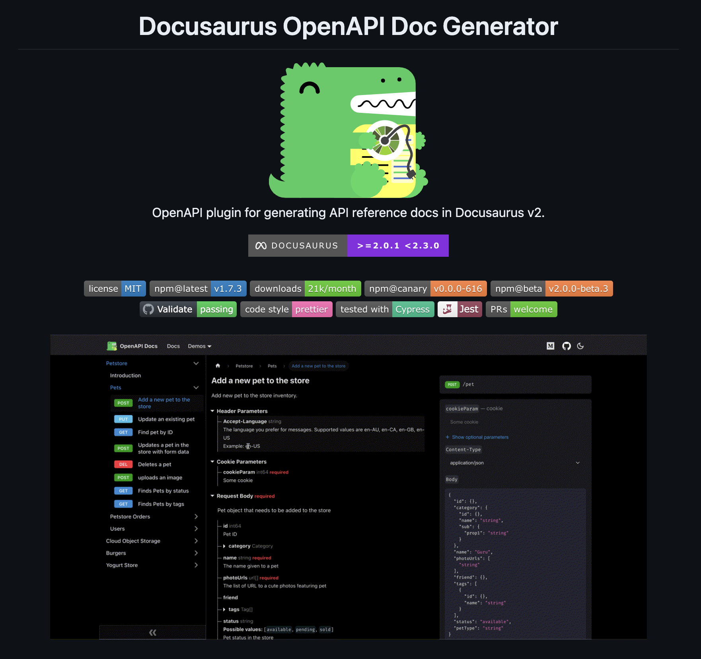
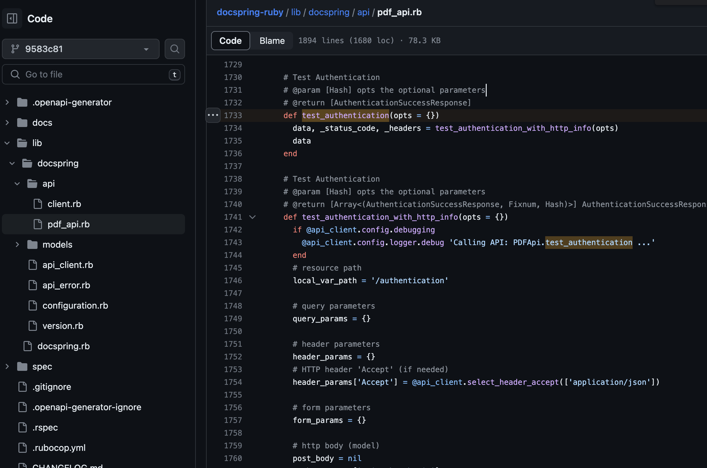
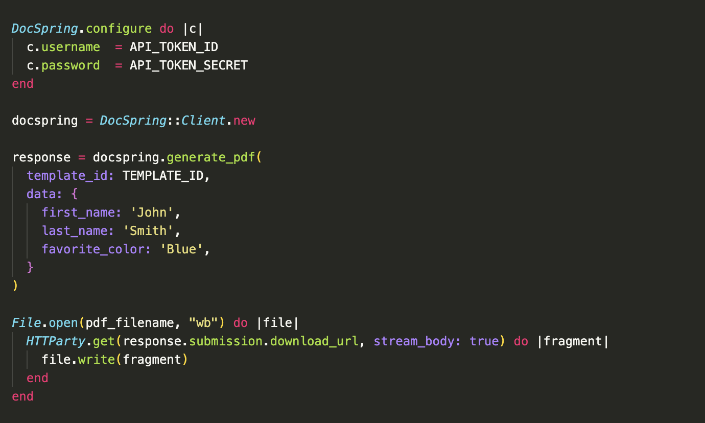

<style>
img[alt~="center"] {
  display: block;
  margin: 0 auto;
}
blockquote {
  font-style: italic;
}
</style>

<!--  -->

# Rswag

### Test-Driven OpenAPI schemas

---

# Hi! I'm Nathan Broadbent

- Ruby on Rails developer since 2010
- Founder of DocSpring.com
  - API for filling and generating PDFs-
  - SaaS app written with Ruby on Rails and React
  - Uses Rswag to describe and test our OpenAPI schema

---

# Tools Covered in Presentation

- Ruby on Rails
- RSpec
- OpenAPI
- Swagger
- Rswag
- OpenAPI Generator

---


- OpenAPI is a specification for describing REST APIs
- Formerly known as _Swagger_
  - "Swagger" is still used for some tooling
    - **OpenAPI** = Specification
    - **Swagger** = Tools for implementing the specification

---

```yaml
openapi: 3.0.0
info:
  title: My API
  version: 1.0.0
paths:
  /users:
    get:
      summary: Get a list of users
      responses:
        "200":
          description: OK
          content:
            application/json:
              schema:
                type: array
                items:
                  $ref: "#/components/schemas/User"
```

---


- Swagger is a set of tools for working with OpenAPI
  - Swagger UI
  - Swagger Editor
- The SmartBear company also has some commercial services
  - SwaggerHub for teams to collaborate

---

## Swagger → OpenAPI

- Swagger was renamed to OpenAPI
- But the Swagger branding is still used
  - **OpenAPI** = API Specification
  - **Swagger** = Tools for implementing the specification

---

# Swagger UI

- Auto-generated documentation


---

# Swagger Editor

- App for manually creating your OpenAPI schema



---

# Rswag

- Extends `rspec-rails` "request specs" with a DSL for describing and testing API operations
- Your API tests can be run like any other RSpec test
- Once you have green tests, run a rake task to auto-generate the corresponding Swagger files
- Expose your Swagger JSON specification

---

# Rswag includes Swagger UI

- Rswag provides an embedded version of Swagger UI assets that you can mount in your app

> Rswag makes it seamless to go from integration specs to living documentation for your API consumers.

---

```ruby
require 'swagger_helper'

RSpec.describe 'API Authentication', rswag: true do
  save_rswag_examples

  path '/authentication' do
    get 'Test Authentication' do
      operationId 'testAuthentication'
      security [api_token_basic: []]
      produces 'application/json'

      response '200', 'authentication succeeded' do
        schema title: :authentication_success_response,
               type: :object,
               properties: { status: { type: :string, enum: %w[success] } }, required: ['status']

        run_test! do |response|
          data = JSON.parse(response.body)
          expect(data['status']).to eq 'success'
        end
      end
# ...
```

---

<!-- _backgroundImage: none -->
<!-- _backgroundColor: #101421 -->



---

`swagger/v1/swagger.json`:

```json
  "paths": {
    "/authentication": {
      "get": {
        "summary": "Test Authentication",
        "operationId": "testAuthentication",
        "security": [ { "api_token_basic": [] } ],
        "produces": [ "application/json" ],
        "responses": {
          "200": {
            "description": "authentication succeeded",
            "schema": {
              "title": "authentication_success_response",
              "type": "object",
              "properties": {
                "status": {
                  "type": "string",
                  "enum": [ "success" ]
                }
              },
              "required": [
                "status"
              ]
            },
            "examples": {
              "application/json": {
                "status": "success"
              }
```

---

# Explore the API with Swagger UI



---

# We are planning to use Docusaurus



---

<!-- _backgroundImage: none -->
<!-- _backgroundColor: #0d1116 -->



---

# OpenAPI Generator

- OpenAPI Generator is a fork of Swagger Codegen
- It can generate code for many languages
- More than 40 top contributors of Swagger Codegen joined OpenAPI Generator as the founding team members


---

<!-- _backgroundImage: none -->
<!-- _backgroundColor: #0d1116 -->



---

<!-- _backgroundImage: none -->
<!-- _backgroundColor: #272822 -->



---

# Advantages of Rswag

- Your API needs integration tests anyway
- No duplication of effort
  - Your API tests are your documentation
  - Your documentation is your API tests
- Swagger UI documentation is always up-to-date and tested

---

# Thanks for listening!

# **Any questions?**
