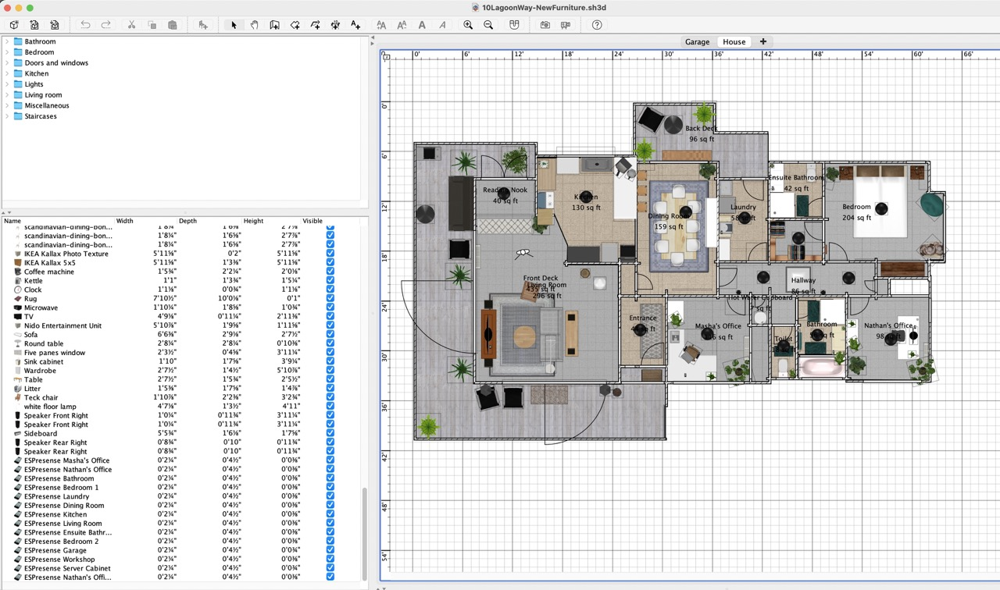

# Ruby at Home

---

# Hello!

### My name is Nathan Broadbent

- Ruby on Rails developer since 2010
- Building DocSpring.com
  - API for filling, signing, and generating PDFs
  - Ruby on Rails app

---

# Hello!

### My name is Nathan Broadbent

- My hobbies include:
  - Home automation
  - Electronics
  - 3D Printing
  - Music

---

Looking through my Google Drive folder for Ruby files...

```bash
~/My Drive
❯ find . | grep "\.rb"
./Music/Sonic Pi/beat1.v2.rb
./Music/Sonic Pi/beat1.rb
./misc_src/update_ffcrm_avatars.rb
./misc_src/fair_distribution.rb
./misc_src/scanner_test.rb
./misc_src/dictionary_sort.rb
./misc_src/rails_rce.rb
./misc_src/export_nacha_entries_csv.rb
./misc_src/total_squares.rb
./misc_src/sq_arel_challenge.rb
./misc_src/ransack_good_default_predicate_order.rb
./misc_src/fix_volunteer_type_for_crm_contacts.rb
./misc_src/markdown_test.rb
./misc_src/safe_transpose_refactor.rb
./misc_src/largest_array_sum.rb
./misc_src/update_hoptoad_notifier.rb
./misc_src/pi.rb
./misc_src/fix_overwritten_volunteer_type_for_crm_contacts.rb
./misc_src/fix_invalid_emails.rb
./misc_src/check_for_new_reddit_submissions.rb
./misc_src/hash_benchmark.rb
./misc_src/co_create_inferred_historical_payroll_item_tax.rb
./misc_src/rack_poc.rb
./misc_src/update_mingle_avatars.rb
./Apartments/2022 - **********, Birkenhead, New Zealand/process_svg.rb
./Apartments/2023 - **********, West Harbour, New Zealand/convert_sweet_home_3d_to_espresense_map.rb
./Documents/zp_all_company_balances_slow.rb
./Documents/openai-interview.rb
./Documents/google-code-challenge.rb
./Documents/edd_test.rb
```

---

# Sonic Pi

### Create music using Ruby code

https://sonic-pi.net

```
./Music/Sonic Pi/beat1.v2.rb
./Music/Sonic Pi/beat1.rb
```

I played with this for a little while and it's very fun.

---


---

# Some more music stuff...

Scripts to automate REAPER (my favorite DAW, or "digital audio workstation".)

https://github.com/ndbroadbent/reaper-scripts

> Here are some scripts I used when setting up a MIDI controller for REAPER to control Playtime (via ReaLearn.)

> The ReaLearn plugin has "import from clipboard" and "export to clipboard" features which make it easy to generate JSON using loops, etc.

> My script generates some ReaLearn config that allows me to change the active PlayTime row by pressing number buttons on my keyboard (1 through 8), and then I can start recording by holding the "record" button and pressing a pad. I can also trigger playback of a track by pressing a pad.

---


---

Used Ruby to generate JSON config:

```ruby
# ...
      mode: {
        type: 2,
        maxStepSize: 0.05,
        minStepFactor: 1,
        maxStepFactor: 1,
        minPressMillis: 200,
        maxPressMillis: 200,
        outOfRangeBehavior: 'min',
        fireMode: 'double'
      },
      target: {
        trackGUID: '506EF9FC-16DF-40F3-A7CE-B5E7499D2833',
        fxAnchor: 'id',
        fxGUID: 'C0C18AB3-74E3-4A23-BA84-443031795E4D',
        paramIndex: clear_and_delete_param_index,
        useProject: true,
        moveView: true,
        seekPlay: true,
        oscArgIndex: 0,
        pollForFeedback: false
      },
      feedbackIsEnabled: false,
      activationType: 'modifiers',
      modifierCondition1: {
        paramIndex: RECORD_BUTTON_PARAM, # When record button is not pressed
        isOn: false
      },
      modifierCondition2: {
        paramIndex: BACK_BUTTON_PARAM, # When back button is pressed
        isOn: true
      }
    }

    value[:mappings] << record_button_mapping
    value[:mappings] << trigger_button_mapping
    value[:mappings] << clear_button_mapping
  end
end

File.open('output.json', 'w') do |f|
  f.puts JSON.pretty_generate(config)
end

puts 'Generated ReaLearn configuration JSON to output.json'
```

---

- I've also used Ruby to write a few scripts for home automation projects. - Home Assistant is written in Python, so I will mostly use Python, shell scripts, and YAML
- But I also write a few scripts using Ruby when it feels like the right tool for the job

<br/>
<br/>
<br/>

#### Here are some of my Home Assistant dashboards...

---


---


---


---


---


---


---


---

P.S. ESP32s are only about $2.27 NZD on AliExpress. Total cost: $36.32 NZD + shipping + some PLA filament for 3D printed cases


---

- I wrote a Ruby script to keep all the settings in sync across 16 ESP32s.
- This script makes a web request to each device and keeps all the settings in sync.

```ruby
@secrets = YAML.load_file(File.join(__dir__, 'configure_espresense_secrets.yml'))
@client = HTTPClient.new

def configure_espresense(node, node_config)
  espresense_domain = "espresense-#{node.to_s.gsub('_', '-')}.home"
  espresense_url = "http://#{espresense_domain}/"

  ip = Resolv.getaddress espresense_domain

  puts "Configuring ESPresense for #{node}... (#{espresense_url} -> #{ip})"
  res = @client.post(espresense_url, {
    language: 'en',
    room: node,
    wifi_timeout: '',
    portal_timeout: '',
    mqtt_host: @secrets['mqtt_host'],
    mqtt_port: @secrets['mqtt_port'],
    mqtt_user: @secrets['mqtt_user'],
    mqtt_pass: @secrets['mqtt_pass'],
    discovery: '1',
    discovery_prefix: '',
    pub_tele: '1',
    pub_NODES: '1',
    pub_devices: '1',
    # auto_update: '1',
    update: '',
    known_macs: '',
    known_irks: @secrets['known_irks'].join(' '),
    query: '',
    # ...
```

---

`convert_sweet_home_3d_to_espresense_map.rb`

I used SweetHome3D to design a floorplan for my house. The following script extracts the positions of ESP32 nodes and converts them to a format that can be imported into the ESPresense Companion config.

---



---

```ruby
#!/usr/bin/env ruby
require 'nokogiri'
require 'yaml'
require 'tmpdir'
require 'fileutils'

SH3D_FILE = '/Users/ndbroadbent/Library/CloudStorage/************/My Drive/Apartments/' \
  '2023 - ********, West Harbour, New Zealand/10LagoonWay-NewFurniture.sh3d'

xml = nil
Dir.mktmpdir do |d|
  FileUtils.cp(SH3D_FILE, "#{d}/home.sh3d")
  Dir.chdir(d) do
    puts "Unzipping #{SH3D_FILE}..."
    `unzip home.sh3d`
    unless File.exist?("#{d}/Home.xml")
      puts "ERROR: Could not find Home.xml"
      exit 1
    end
    puts "Parsing Home.xml..."
    xml = Nokogiri::XML(File.read "#{d}/Home.xml")
  end
end

min_x = 0
min_y = 0
rooms = xml.xpath('//home/room').map do |room|
  next nil unless %w[Garage Workshop].include? room['name']
  {
    'name' => room['name'],
    'points' => room.xpath('point').map do |p|
      [
        (p['x'].to_f / 100 - min_x).round(3).abs,
        (p['y'].to_f / 100 - min_y).round(3).abs
      ]
    end
  }
end.compact

min_x = 0
min_y = 0
max_x = 0
max_y = 0
rooms.each do |r|
  r['points'].each do |p|
    max_x = [max_x, p[0]].max
    max_y = [max_y, p[1]].max
  end
end
#...
```

---

### ESPresense Companion Config

```
nodes:
  - name: mashas_office
    point: [9.983, 10.035, 3.0]
    floors: ["house"]
  - name: nathans_office
    point: [18.391, 8.27, 3.0]
    floors: ["house"]
  - name: nathans_office_shelf
    point: [15.953, 9.426, 3.0]
    floors: ["house"]
  - name: bathroom
    point: [15.46, 9.084, 3.0]
    floors: ["house"]
  - name: bedroom_1
    point: [15.73, 2.48, 3.0]
    floors: ["house"]
  - name: bedroom_2
    point: [18.46, 2.45, 3.0]
    floors: ["house"]
  - name: bedroom_tv
    point: [17.65, 6.375, 3.0]
    floors: ["house"]
  - name: ensuite
    point: [13.18, 3.17, 3.0]
    floors: ["house"]
  - name: laundry
    point: [11.3, 4.8, 3.0]
    floors: ["house"]
  - name: dining_room
    point: [10.7, 2.4, 3.0]
    floors: ["house"]
  - name: kitchen
    point: [4.6, 2.2, 3.0]
    floors: ["house"]
  - name: living_room
    point: [2.816, 8.847, 3.0]
    floors: ["house"]
  - name: living_room_shelf
    point: [7.12, 6.155, 3.0]
    floors: ["house"]
```

---


---

`mac_airtag_to_mqtt`

https://github.com/ndbroadbent/mac_airtag_to_mqtt

I wanted to see my AirTag location data in Home Assistant, so I wrote a Ruby script to fetch the AirTag data from my Mac, and publish it to Home Assistant via MQTT.

I ran this on a MacOS VM on my home server (via Proxmox / qemu.)

> _Sadly this no longer works since Apple has recently started encrypting the file._

---


---

```ruby

MQTT_TOPIC_NAME = ENV.fetch('MQTT_TOPIC_NAME')
MQTT_TOPIC = "mac_airtag_to_mqtt_#{MQTT_TOPIC_NAME}".freeze
AIRTAGS_DATA_FILE = "/Users/#{ENV.fetch('MAC_USERNAME')}/Library/Caches/com.apple.findmy.fmipcore/Items.data".freeze

# ...

    loop do
      puts "Reading airtags data from #{AIRTAGS_DATA_FILE}..." if DEBUG
      airtags = JSON.parse(File.read(AIRTAGS_DATA_FILE))
      puts "Publishing MQTT messages for #{airtags.count} airtags..." if DEBUG
      airtags.each do |airtag|
        state_topic = "#{MQTT_TOPIC}/#{airtag['identifier']}/state"
        json_attributes_topic = "#{MQTT_TOPIC}/#{airtag['identifier']}/attributes"
        ha_config_topic = "homeassistant/device_tracker/#{MQTT_TOPIC}_#{airtag['identifier']}/config"

        name = airtag['name']
        location = airtag['location'] || {}
        address = airtag['address'] || {}

        name = if name.end_with?('Bud')
          "#{ENV.fetch('AIRPODS_NAME')} - #{name}"
        else
          "AirTag - #{name}"
        end

        is_home = address['streetName'] == ENV.fetch('HOME_STREET_NAME') &&
                  address['streetAddress']&.start_with?(ENV.fetch('HOME_STREET_ADDRESS'))

        puts "=> #{ha_config_topic}: #{name}" if DEBUG
        client.publish(
          ha_config_topic,
          {
            state_topic:,
            name:,
            unique_id: "#{MQTT_TOPIC}_#{airtag['identifier']}",
            payload_home: 'home',
            payload_not_home: 'not_home',
            json_attributes_topic:,
          }.to_json
        )
```

---


---

# Novation Launchpad Pro Dashboard

- I have a Novation Launchpad Pro MIDI controller
- I use to create drum beats and for live looping sessions, but most of the time it just sits on my desk doing nothing
- I decided to use the lights to display some information when I'm not using it for music

---


---

https://github.com/arkku/launchpad-ruby

```ruby
require_relative 'kk_launchpad'
require 'pry-byebug'
require 'hass/client'
require 'httparty'
require 'json'

require 'yaml'
require 'awesome_print'

CONFIG = YAML.load_file('config.yml').transform_keys(&:to_sym)

@hass_client = Hass::Client.new(CONFIG.fetch(:hass_host), CONFIG.fetch(:hass_port), CONFIG.fetch(:hass_token))

# CircleCi.configure do |config|
#   config.token = CONFIG.fetch(:circleci_token)
# end
# @recent_ci_builds = CircleCi::RecentBuilds.new

MAX = 0x3f
HALF = MAX / 2

lp = LaunchpadMIDI.device(true)
lp.reset

# Turnn off side LED
lp.set_leds([99, 0])

HOUSE_LIGHTS_ARRANGEMENT = [
  [ nil,       nil,       nil,       :b_deck,   :b_deck,   :ensuite,  :bedroom,  :bedroom ],
  [ :f_deck,   :nook,     :kitchen,  :dining,   :laundry,  :closet,   :bedroom,  :bedroom ],
  [ :f_deck,   :living,   :living,   :entrance, :hallway,  :hallway,  :hallway,  :hallway ],
  [ :f_deck,   :living,   :living,   :f_door,   :m_office, :toilet,   :bathroom, :n_office ]
].reverse.flatten.freeze

HOUSE_LIGHTS_MAPPING = {
  b_deck: :all_back_deck_lights,
  f_deck: :all_front_deck_lights,
  ensuite: :all_ensuite_lights,
  bedroom: :all_bedroom_lights,
  nook: :all_reading_nook_lights,
  kitchen: :all_kitchen_lights,
  dining: :all_dining_room_lights,
  laundry: :all_laundry_lights,
  closet: :all_bedroom_closet_lights,
  living: :all_living_room_lights,
  entrance: :all_entrance_lights,
  hallway: :all_hallway_lights,
  f_door: :front_door_light,
  m_office: :mashas_office_light,
  toilet: :toilet_light,
  bathroom: :all_bathroom_lights,
  n_office: :nathans_office_light
}
```

---

```ruby
# ...

@lights_turned_off = false

@previous_light_values = nil
Thread.new do
  loop do
    if @needs_light_update
      @needs_light_update = false

      if !@active
        if !@lights_turned_off
          puts "Computer not active, turning off lights..."
          lp.reset
          @lights_turned_off = true
        end
        next
      end

      @lights_turned_off = false

      if @light_values != @previous_light_values
        if @needs_ci_update
          lp.set_all_leds_rgb(@light_values, 1)

          if @workflow_states
            # Pulse the LED if the workflow state is :running.
            # Call set_leds_pulse only once.
            # Note: grid for set_leds_pulse is 10x10, not 8x8
            pulse_leds = []
            @workflow_states.each_with_index do |state, index|
              next unless state == :running
              pulse_leds << [81 + index, 67]
            end
            lp.set_leds_pulse(pulse_leds) if pulse_leds.any?
          end

          @needs_ci_update = false
        else
          # Only update first 7 rows
          lp.set_all_leds_rgb(@light_values[0...56], 1)
        end

        @previous_light_values = @light_values
      end
    end

    sleep 0.05
  end
end

# ...
```

---

## 

---

# `check_for_new_reddit_submissions.rb`

This script checks a Reddit username for new posts, then announces it out loud using Google's text-to-speech API. I can't remember what I needed this for. Something to do with a competition, or one of Reddit's april fools things.

---

```ruby
#!/usr/bin/env ruby
require 'httparty'

def speak(text)
  `mplayer "http://translate.google.com/translate_tts?ie=UTF-8&tl=en&q=#{text}" &>/dev/null`
end

user = ARGV[0]
raise 'User is required' unless user

text = "There is a new submission from #{user}"
url  = "http://www.reddit.com/user/#{user}/submitted.json"

response = HTTParty.get(url)
initial_count = response['data']['children'].size

puts "'#{user}' currently has #{initial_count} submissions."

# Check for new submission every 60 seconds
while true
  sleep 60

  response = HTTParty.get(url)
  new_count = response['data']['children'].size

  if new_count > initial_count
    puts "'#{user}' now has #{new_count} submissions!"

    # Play alert 5 times if new submission
    5.times do
      speak(text)
    end
    exit
  end
end
```

---

# Advent of Code 2023

I used Ruby to solve a few puzzles for Advent of Code 2023.

---


---


---

# One of my earliest projects...

https://madebynathan.com/2013/07/10/raspberry-pi-powered-microwave/

I put a Raspberry Pi in a microwave and wired up a barcode scanner and voice recognition. I used Ruby to write all the software that controls the microwave.

---


---


---

# Other things you can do with Ruby:

---

## Make games with https://dragonruby.org


---

## Create 3D models with SolidRuby (OpenSCAD for Ruby)

https://github.com/MC-Squared/SolidRuby


> Thanks to Eaden McKee for doing a talk on this library a while ago!

---

# Conclusion

Ruby is awesome

---

# Thank you!
