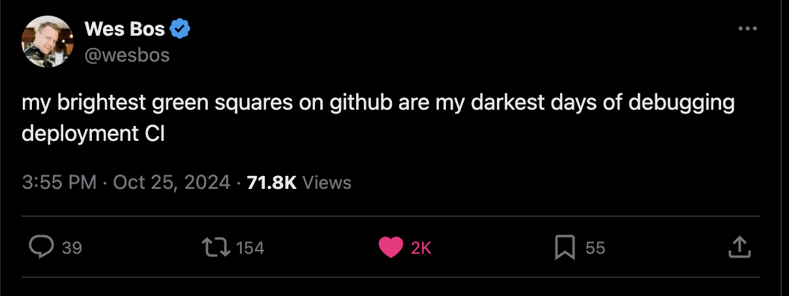
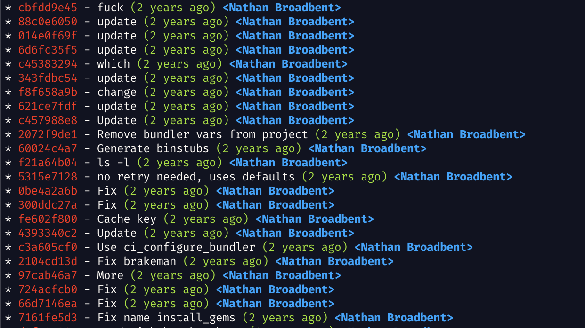
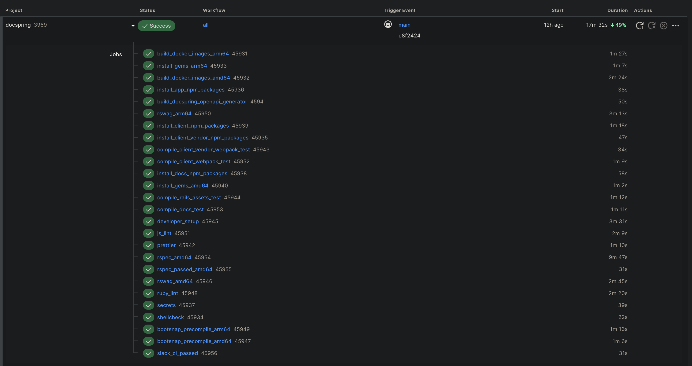
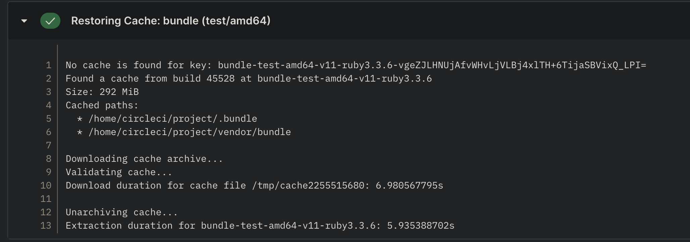
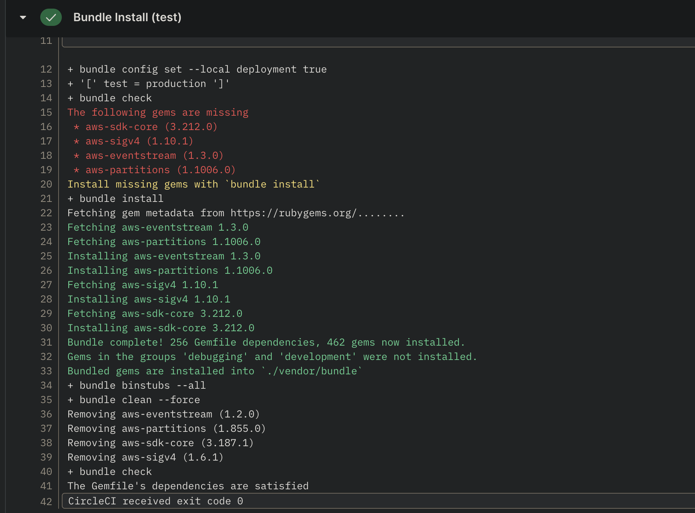
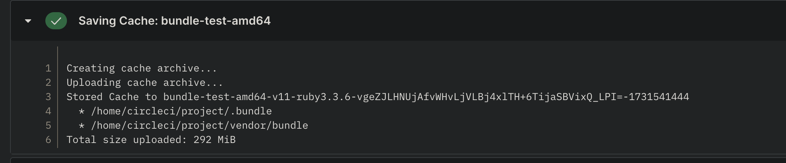
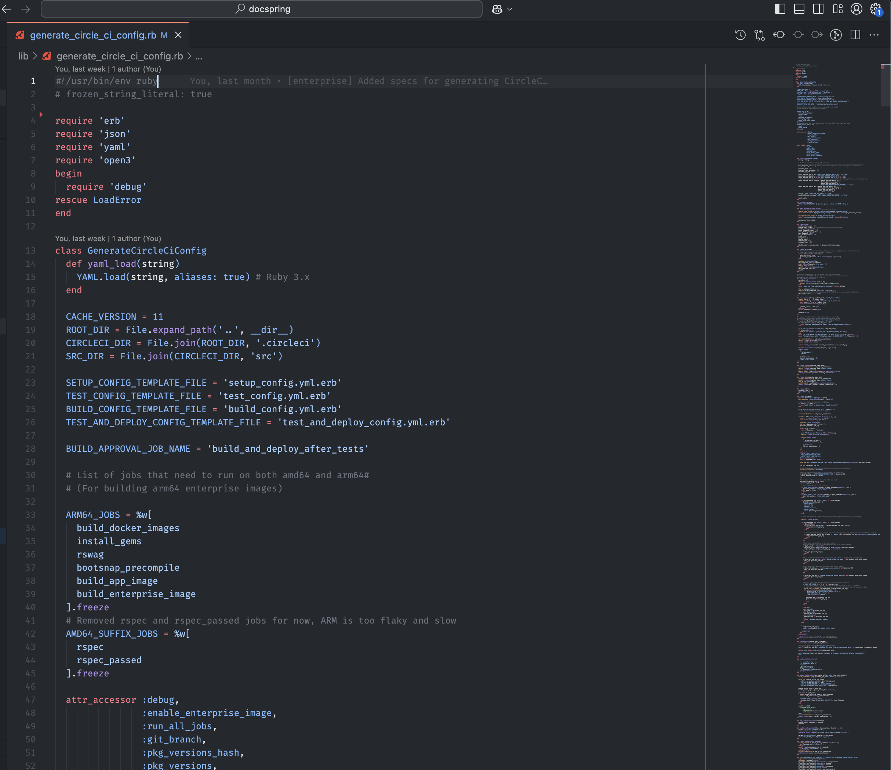
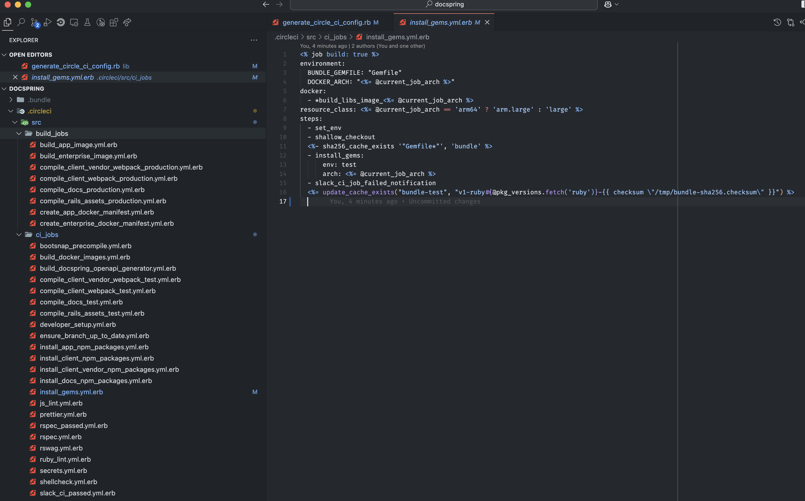
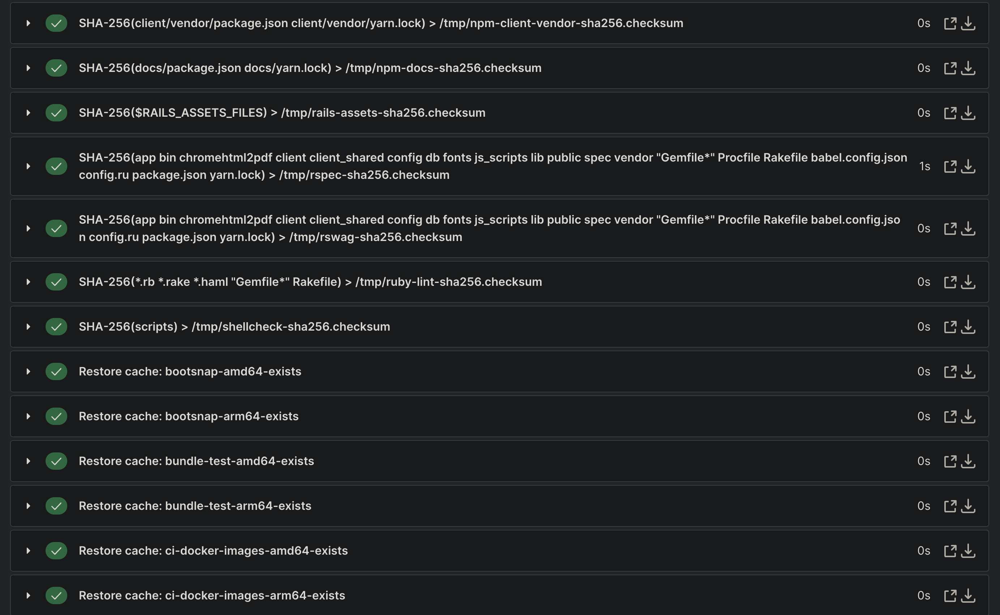

# Complex CI Config

### Advanced Caching for CI/CD Pipelines

---

# Hello!

### My name is Nathan Broadbent

- Ruby on Rails developer since 2010
- I've been working on DocSpring.com since 2017
  - API for filling, signing, and generating PDFs
  - Ruby on Rails app

---

# What is CI/CD?

---

# What is CI/CD?

- CI: Continuous Integration

> "Continuous integration is the practice of integrating source code changes frequently and ensuring that the integrated codebase is in a workable state."

---

# What is CI/CD?

- CD: Continuous Delivery / Continuous Deployment

#### Continuous Delivery:

> Continuous delivery is an extension of continuous integration since it automatically deploys all code changes to a testing and/or production environment after the build stage.

#### Continuous Deployment:

> Continuous deployment goes one step further than continuous delivery. With this practice, every change that passes all stages of your production pipeline is released to your customers. There's no human intervention, and only a failed test will prevent a new change to be deployed to production.

---

# What is CI/CD?

In other words:

- CI: Make sure your code works by running tests
- CD: Automatically deploy your code to staging / production

---

# CI/CD Services

- GitHub Actions
- GitLab CI
- CircleCI
- Jenkins

---

# First of all...

---

# First of all...

# I like writing CI config

---

# First of all...

# I like writing CI config

### it's fun

---

### sometimes



---


---



---

### DocSpring Scheduled CI/CD Pipeline



---

### DocSpring Scheduled CI/CD Pipeline

- We use GitHub and CircleCI
- This pipeline runs once a day
- Checks for security updates for Ruby gems, system packages, etc.

---

# Caching Techniques

### Example: Installing Ruby gems

Always required before we can run any tests.

---

### Restore Cache



---

### Install new gems



---

### Upload new cache for the next run



---

# CI Job: Install Ruby Gems

With cache:

### Duration: **1m 10s**

Without cache:

### Duration: **3m 34s**

---

# CI Job: Install Ruby Gems

Total time with cached gems: **1m 10s**

- Spin up docker container: **17 seconds**
- Restore cache: **13 seconds**
- Installing gems: **11 seconds**
- Save cache: **20 seconds**

---

# CI Job: Install Ruby Gems

- What if no gems have changed since the last run?
  - (This is the case for most CI builds.)
- We still have to spend about a minute starting the container, restoring the cache, then saving the cache.

---

### How can we make this more efficient?

---

### How can we make this more efficient?

# Just skip the "install gems" job

---

### Wait... How can we skip the job?

- Figure out a way to avoid restoring/saving the bundler cache?
- But we still have to put the job in our CircleCI configuration file.
- It's always going to take about 20 seconds to start the Docker container, even if it doesn't do anything.
- The RSpec tests depend on this job, so we have a pointless delay.

---

### How can we skip the job?

# Dynamic CircleCI configuration!

---

### How can we skip the job?

# Dynamic CircleCI configuration!

https://circleci.com/docs/dynamic-config

- This gives us the basic building blocks we need to create a highly efficient CI pipeline.

---

# Dynamic CircleCI configuration!

- Instead of running a single CI workflow, we can run two workflows.
- The first workflow is responsible for generating the CircleCI configuration file.
- Then we can trigger the second workflow which uses the generated configuration.

---

# So what's the point???

---

# So what's the point???

- Figure out when we don't need to run the "install gems" job
- Skip the job when it's not needed

---


> "Insanity is doing the same thing over and over and expecting a different result." - Albert Einstein

---


> "Insanity is doing the same thing over and over and expecting a different result." - ~~Albert Einstein~~ Rita Mae Brown

---

# When do we need to install gems?

- If the `Gemfile` or `Gemfile.lock` file has changed
- If the Ruby version has changed
- If the Debian version has changed
- If the CircleCI configuration has changed

#### Otherwise, if everything is the same, then we won't get a different result.

---

# When do we need to install gems?

- If the `Gemfile` or `Gemfile.lock` file has changed
- If the Ruby version has changed
- If the Debian version has changed
- If the CircleCI configuration has changed

#### Otherwise, if everything is the same, then we won't get a different result. (Probably.)

---

# Idea:

- Create a "hash" based on `Gemfile`, `Gemfile.lock`, Ruby version, and Debian version.
- After we've installed the gems, upload the bundler cache, and then save this hash somewhere
- Next time we run the initial CI job, check to see if we have any cached gems for this hash
- If so, skip the "install gems" job.

---

# WAIT! This is starting to sound very complicated.

---

# You're going to have to write some code to generate this dynamic CircleCI configuration.

---

# What language could be used to write such a thing?

---


# Ruby!

---



---



---

# Tools:

- Ruby script
- ERB templates
- RSpec tests!
  - (We have tests for our tests)

---


---


---

# Idea:

- Create a "hash" based on `Gemfile`, `Gemfile.lock`, Ruby version, and Debian version.
- After we've installed the gems, upload the bundler cache, and **then save this hash somewhere**
- Next time we run the initial CI job, check to see if we have any cached gems for this hash
- If so, skip the "install gems" job.

---

# So where can we save these hashes?

- We can use the CircleCI cache. We can upload an empty file to show if the hash is present or absent

---

Command to save the cache files:

```yaml
description: Upload an *-exists file to indicate that the cache exists
parameters:
  key:
    type: string
    description: Name to use for the cache key and file, e.g. rails-assets
  cache_suffix:
    type: string
    description: Suffix to use for the cache key, e.g. checksum
  arch:
    type: string
    description: CPU architecture of the job
steps:
  - run: touch /tmp/<< parameters.key >>-<< parameters.arch >>-exists
  - save_cache:
      key: "<%= cache_exists_key_format %>-{{ epoch }}"
      paths:
        - "/tmp/<< parameters.key >>-<< parameters.arch >>-exists"
      name: "Saving Cache: << parameters.key >>-<< parameters.arch >>-exists"
```

---

Commands to restore the cache files:

```erb
      <%= render_cache_exists_commands %>
      <% @cache_exists_keys.uniq.each do |cache_key| %>
      - restore_cache:
          name: "Restore cache: <%= cache_key[/^(.+-exists)-/, 1] %>"
          keys:
            - <%= cache_key -%>
```

---

e.g.

```
    - restore_cache:
        name: 'Restore cache: bootsnap-amd64-exists'
        keys:
        - bootsnap-amd64-exists-v11-b712f80d5b15-v1-\
        {{ checksum "/tmp/bootsnap-sha256.checksum"
          }}
    - restore_cache:
        name: 'Restore cache: bootsnap-arm64-exists'
        keys:
        - bootsnap-arm64-exists-v11-b712f80d5b15-v1-\
        {{ checksum "/tmp/bootsnap-sha256.checksum"
          }}
    - restore_cache:
        name: 'Restore cache: bundle-test-amd64-exists'
        keys:
        - bundle-test-amd64-exists-v11-b712f80d5b15-v1-ruby3.3.6-\
        {{ checksum "/tmp/bundle-sha256.checksum"
          }}
...
```

---

CI commands to calculate SHA-256 hashes:

```
description: Calculate SHA-256 hash of files and save to file
parameters:
  files:
    type: string
  checksum_file:
    type: string
  src_directory:
    type: string
    default: ''
  repo_directory:
    type: string
    default: ''
steps:
  - run:
      name: SHA-256(<< parameters.files >>) > /tmp/<< parameters.checksum_file >>-sha256.checksum
      command: |
        if [ -n "<< parameters.src_directory >>" ]; then
          cd << parameters.src_directory >>
        fi
        SRC_DIRECTORY="$(pwd)"
        if [ -n "<< parameters.repo_directory >>" ]; then
          cd << parameters.repo_directory >>
        fi
        export IGNORE_CIRCLECI_CONFIG=true
        $SRC_DIRECTORY/scripts/ci/calculate_sha256_hash << parameters.files >> | tee /tmp/<< parameters.checksum_file >>-sha256.checksum
```

---



---

# Deep dive into some code?

---

# Any questions?

---

# Thanks for your time!

# https://github.com/ndbroadbent/talks

- nathan@docspring.com
- https://docspring.com
