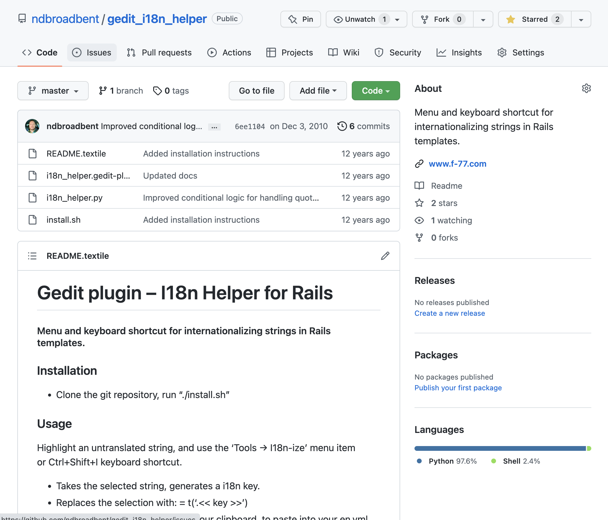
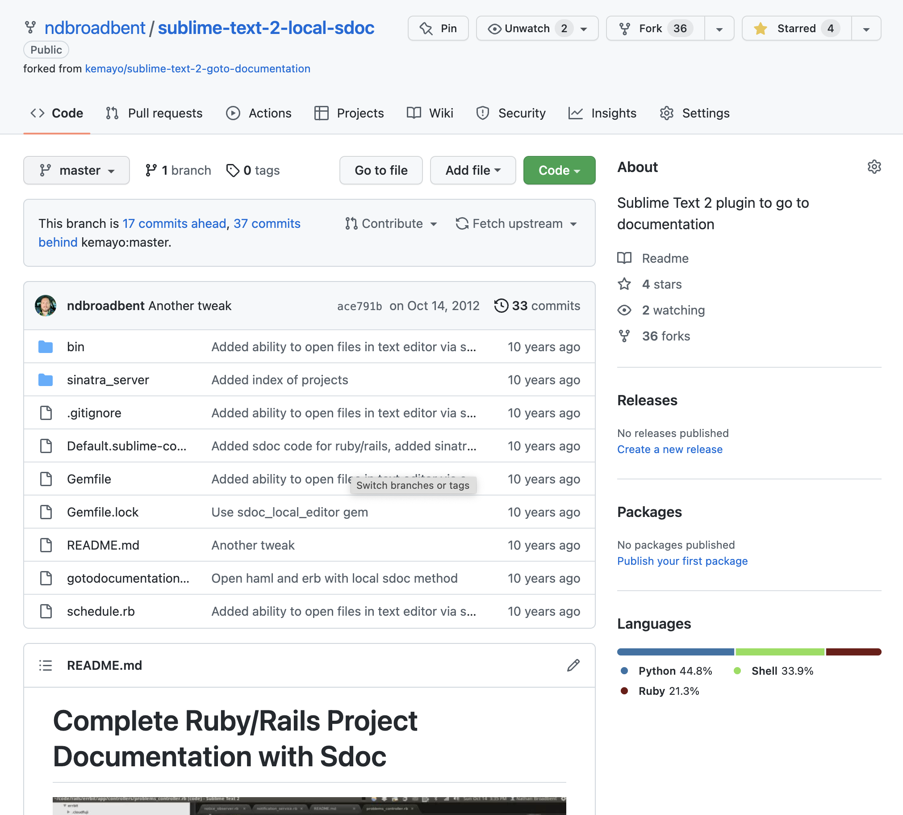
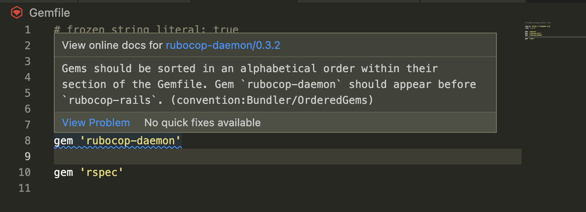
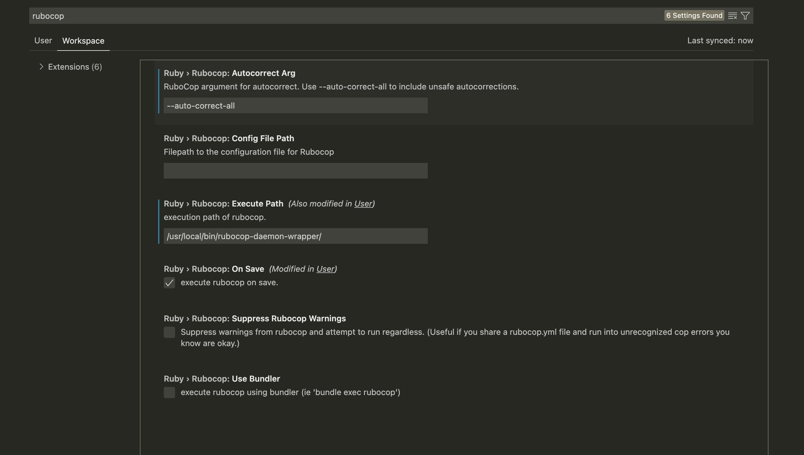
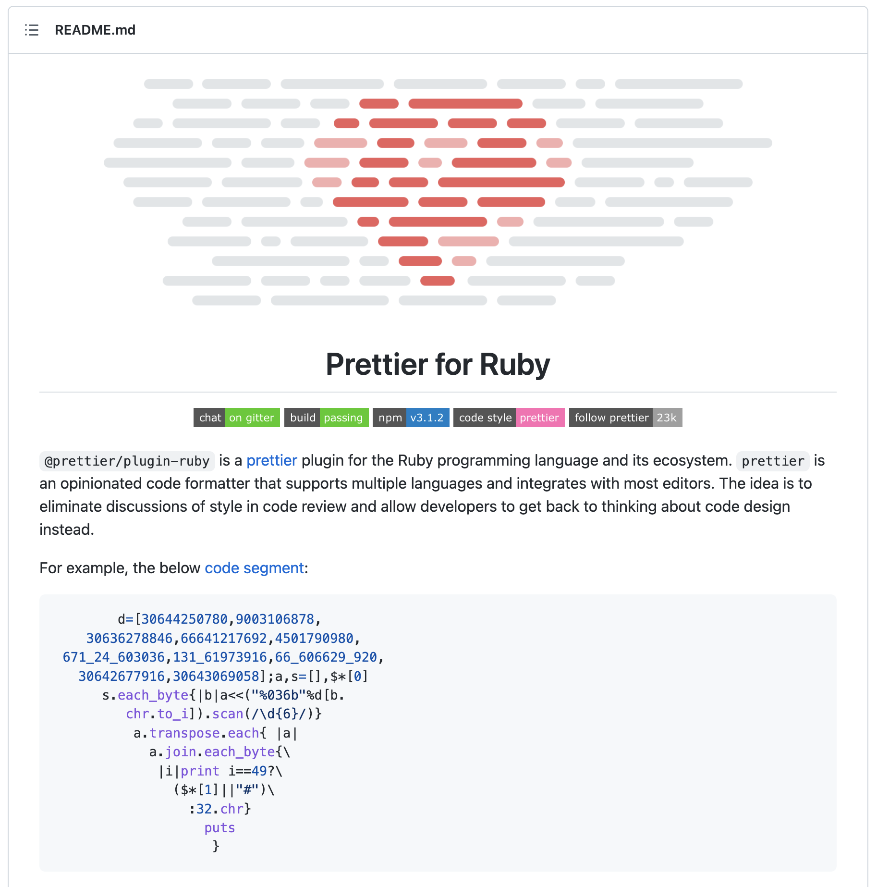
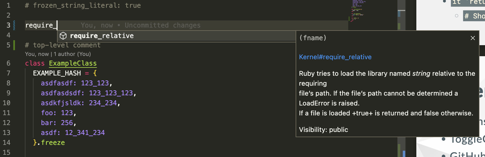
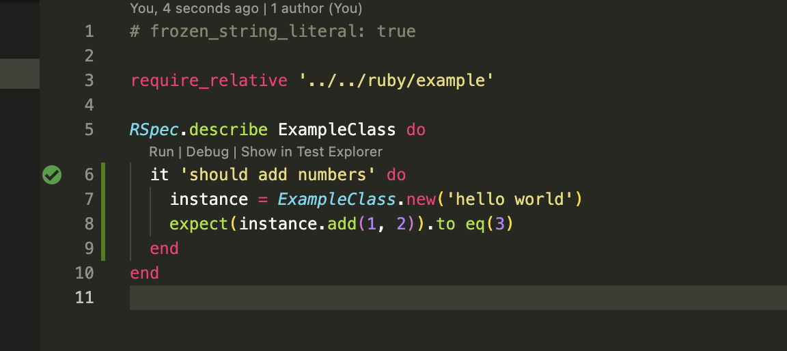
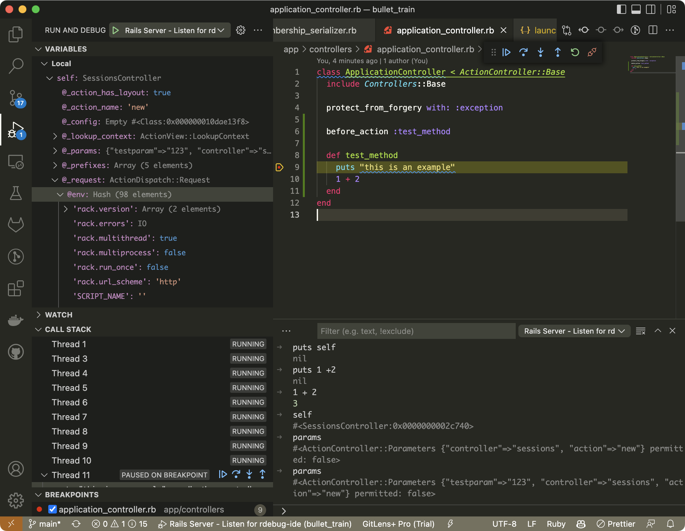

# **Ruby Development in VS Code**

Tips and tricks for developing Rails applications in VS Code

---

# **Hello!**

## My name is Nathan Broadbent.

- Ruby on Rails developer since 2010
- I'm the founder of DocSpring.com
  - PDF templating service written with Ruby on Rails and React

---

# Which editors have I used?

- Gedit (Ubuntu)
- Vim (briefly)
- Sublime Text
- RubyMine
- Atom
- VS Code

I looked through my old GitHub repos to find some history:

---



---



---

# What do I look for in an editor?

- **Fast!**
- Support for all the languages I use
- Good syntax highlighting
- Linting, format on save, trim trailing whitespace, etc.
- Large ecosystem of plugins and integrations

---

I switched to VS Code and now take many of these things for granted. I used to waste a lot of time trying to fix syntax highlighting (Gedit, sublime text, etc.), or write / fix various plugins.

VS Code is super fast (even with lots of extensions.)

- 14 million monthly active users
- #1 editor in StackOverflow 2021 Developers Survey, with 70% of the 82,000 respondents using it

---

# **Topics**

- ### How I set up "format on save" with RuboCop (and how I made it fast)
- ### How I use VS Code as a Ruby IDE
- ### GitHub Copilot + RuboCop 🤯🤯🤯
- ### Other extensions and gems I like to use

---

# **RuboCop Formatting Example**

```ruby
class    ExampleClass
EXAMPLE_HASH = {        asdfasdf: 123_123, asdfasdsdf: 123_123,
asdkfjsldk: 234_234,      foo: 123, bar: 256, asdf: 12_341_234 }.freeze

def initialize(arg    )
@arg = arg
end

def do_something
puts "Hello #{@arg}"
end
end
```

---

```ruby
# frozen_string_literal: true

class ExampleClass
  EXAMPLE_HASH = {
    asdfasdf: 123_123,
    asdfasdsdf: 123_123,
    asdkfjsldk: 234_234,
    foo: 123,
    bar: 256,
    asdf: 12_341_234
  }.freeze

  def initialize(arg)
    @arg = arg
  end

  def do_something
    puts "Hello #{@arg}"
  end
end
```

---

# **Problem:**

### RuboCop is very slow on large Ruby files, or with lots of extensions


<!--

---

<video width="100%" height="100%" autoplay muted controls src="assets/rubocop-slow.mov" />
-->

---

# **Solution:**

# rubocop-daemon

<!--
RuboCop can take a long time just to load all of the rules and extensions (e.g. `rubocop-rails`, `rubocop-rspec`). This might take a few seconds before it even starts looking at your code. -->

`rubocop-daemon` is like Spring for RuboCop. Load everything once, start up a daemon server, and re-use the same RuboCop process for everything.

---

<video width="100%" height="100%" autoplay muted controls src="assets/rubocop-fast.mov" />

---

The `rubocop-daemon` client that connects to the server was originally written in Ruby. I rewrote it as a bash script using `netcat` to make it much faster.

Check out the **More Speed** section in the README to install the `rubocop-daemon-wrapper` bash script:

https://github.com/fohte/rubocop-daemon#more-speed

---

# **More than just formatting!**

The `ruby-rubocop` VS Code extension calls `rubocop --auto-correct` by default. This can format code and fix a few simple issues (linting rules with "safe" corrections.)

I sent a PR for a new `autocorrectArg` option so that we can call `rubocop --auto-correct-all` (or `-A`) to automatically fix lots of other issues.

https://github.com/misogi/vscode-ruby-rubocop/pull/168

---



---

```markdown
source "https://rubygems.org"
ruby "3.1.2"

gem "rubocop-rails"
gem "rubocop-daemon"
gem "rubocop"
gem "rspec"
```

---

```markdown
# frozen_string_literal: true

source 'https://rubygems.org'
ruby '3.1.2'

gem 'rspec'
gem 'rubocop'
gem 'rubocop-daemon'
gem 'rubocop-rails'
```

- Adds `frozen_string_literal: true` comment
- Uses single quotes instead of double quotes
- Even sorts gems alphabetically! (`Bundler/OrderedGems` rule)

---

# **Is this dangerous??**


---

# **Not really!**

Better to apply these corrections while the code is right in front of you and it's still fresh in your mind.

(Also I don't think RuboCop's `--auto-correct-all` option is very dangerous. It has always made sensible changes for me, and I haven't experienced any bugs.)

---

```json
{
  "files.trimTrailingWhitespace": true,
  "editor.formatOnSave": true,
  "[ruby]": {
    "editor.defaultFormatter": "misogi.ruby-rubocop"
  },
  "ruby.rubocop.executePath": "/usr/local/bin/rubocop-daemon-wrapper/",
  "ruby.rubocop.autocorrectArg": "--auto-correct-all",
  "ruby.rubocop.onSave": true
}
```

---



---

## **Prettier for Ruby**

https://github.com/prettier/plugin-ruby

Another option for formatting Ruby code.



---

- Prettier can only format code. It can't fix any linting issues like RuboCop.
- Prettier is faster by default
- Prettier is a bit more opinionated about formatting, and I think it does a slightly better job with hashes


<!--

---

# **Formatting a hash with RuboCop**

```ruby
example_hash = { asdfasdf: 123_123, asdkfjsldk: 234_234, foo: 123, bar: 256, asdf: 12_341_234 }.freeze
```

---

# **Formatting a hash with Prettier**

```ruby
example_hash = {
  asdfasdf: 123_123,
  asdkfjsldk: 234_234,
  foo: 123,
  bar: 256,
  asdf: 12_341_234
}.freeze
```

---

## **Approximating “Prettier for Ruby” with RuboCop**

Flexport worked on some new RuboCop rules to make it format Ruby files similar to Prettier.

https://flexport.engineering/approximating-prettier-for-ruby-with-rubocop-8b863bd64dc6
-->

<!--

I've been trying to get these to work together, but it's a challenging problem.

- VS Code doesn't support multiple formatters
- I tried a few different approaches, but they all had some issues
  - Too slow (prettier had to load it's Ruby parsing server each time)
  - Produced unsaved changes, so had to save twice
- Will keep trying - Perhaps a Prettier plugin would work.
  I will try to get `vscode-ruby-rubocop` working with `prettierd`:

https://github.com/fsouza/prettierd
Install `@prettier/plugin-ruby`: https://github.com/prettier/plugin-ruby

I had to install `@prettier/plugin-ruby` inside the VS Code extension directory to get it to work properly:

```
cd ~/.vscode/extensions/esbenp.prettier-vscode-9.5.0/
npm install @prettier/plugin-ruby
```

Now you should see a `node_modules/@prettier/plugin-ruby/` directory inside `~/.vscode/extensions/esbenp.prettier-vscode-9.5.0`

---

`@prettier/plugin-ruby` is designed to work with RuboCop. They have a `.rubocop.yml` configuration file that can disable the RuboCop's formatting rules that clash with Prettier.

Use the `.rubocop.yml` from the `npm` package (seems to be updated more regularly):

```
inherit_from:
  - node_modules/@prettier/plugin-ruby/rubocop.yml
```

---

VS Code doesn't support multiple code formatters.

It was quite difficult to figure out how to integrate these two VS Code extensions and get them to work together.

I forked the `vscode-ruby-rubocop` extension to add a new `postFormatVSCodeCommand` option. This lets me call Prettier once the RuboCop extension has fixed any linting issues.

https://github.com/misogi/vscode-ruby-rubocop/pull/170

---

How to install my fork of `vscode-ruby-rubocop` with the new `autocorrectArg` and `postFormatVSCodeCommand` options:

```bash
git clone https://github.com/ndbroadbent/vscode-ruby-rubocop.git
cd vscode-ruby-rubocop
vsce package  # Builds the VS Code extension
code --install-extension ruby-rubocop-0.8.6.vsix
```

Then quit and restart VS Code.

---

## **Check if Prettier for Ruby is working**

Click "Prettier" in the status bar at the bottom.


---

This will show the Prettier logs. You should see the `"ruby"` language listed in the output:


---

# Only RuboCop

```ruby
# frozen_string_literal: true

class ExampleClass
  EXAMPLE_HASH = {
    asdfasdf: 123_123,
    asdkfjsldk: 234_234,
    foo: 123,
    bar: 256,
    asdf: 12_341_234
  }.freeze

  def initialize(arg)
    @arg = arg
  end

  def do_something
    puts "Hello #{@arg}"
  end
end
```

# RuboCop + Prettier

```ruby
# frozen_string_literal: true

class ExampleClass
  EXAMPLE_HASH = {
    asdfasdf: 123_123,
    asdkfjsldk: 234_234,
    foo: 123,
    bar: 256,
    asdf: 12_341_234
  }.freeze

  def initialize(arg)
    @arg = arg
  end

  def do_something
    puts "Hello #{@arg}"
  end
end
``` -->

---

# **VS Code as a Ruby IDE**

- Solargraph
  - See where methods are defined
  - View method documentation
- Endwise - `end` helper extension
- Ruby Test Explorer
- Using the VS Code debugger - `ruby-debug-ide`, `debase`

---

# **Solargraph**



---

# **Solargraph**


---

# **Endwise**


---

# **Ruby Test Explorer**



---



---

- Gemfile

```ruby
gem 'debase', '~> 0.2.5.beta2'
gem 'ruby-debug-ide'
```

---

- `.vscode/launch.json`

```
{
  // Use IntelliSense to learn about possible attributes.
  // Hover to view descriptions of existing attributes.
  // For more information, visit: https://go.microsoft.com/fwlink/?linkid=830387
  "version": "0.2.0",
  "configurations": [
    {
      "name": "Rails Server - Listen for rdebug-ide",
      "type": "Ruby",
      "request": "attach",
      "remoteHost": "0.0.0.0",
      "remotePort": "1234",
      "remoteWorkspaceRoot": "${workspaceRoot}"
    }
  ]
}
```

---

Starting the Rails server using `rdebug-ide`:

```bash
rdebug-ide --host 0.0.0.0 \
  --port 1234 --dispatcher-port 1234 --skip_wait_for_start -- \
  bin/rails s
```

---

# **Live coding demo with GitHub Copilot**

Let's try to write some Ruby code and see what happens...

---

<small>

Copilot ideas:

- `# A method that adds two numbers`
- `# A method that takes a full name and returns a first name`
- `def fizz_buzz` ...
  - Maybe need: `# Refactor to use guard clauses`
  - Autocomplete test in `spec/ruby/example_spec.rb`
  - maybe help it out with `instance = ExampleClass.new('foo')`
- `it 'returns the correct result for sha256_hash' do`
  - Autocomplete the code in `example.rb`
- `it 'returns the correct result for number_lookup' do`
  - `# Should be symbols`

</small>

---

# Other Extensions

- GitLens
- ToggleQuotes
- GitHub Copilot
- Gemfile.lock highlight
- FileUtils
- Color Picker
- pdf

---

# Thanks!

# **Questions?**
